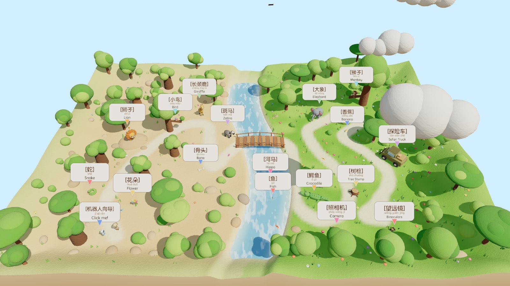
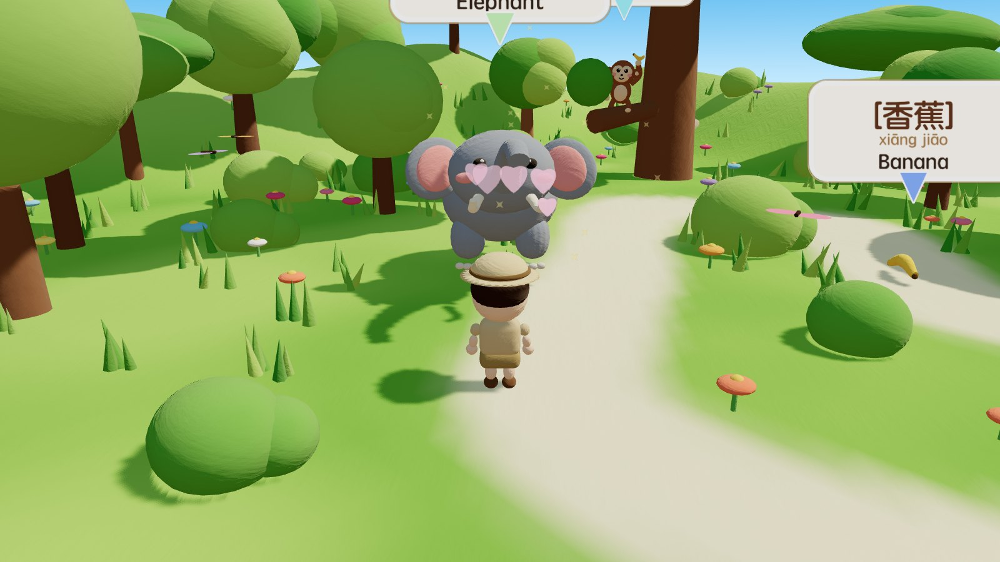
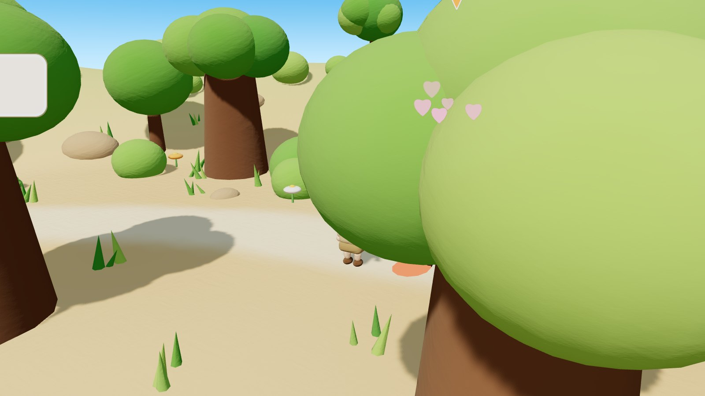
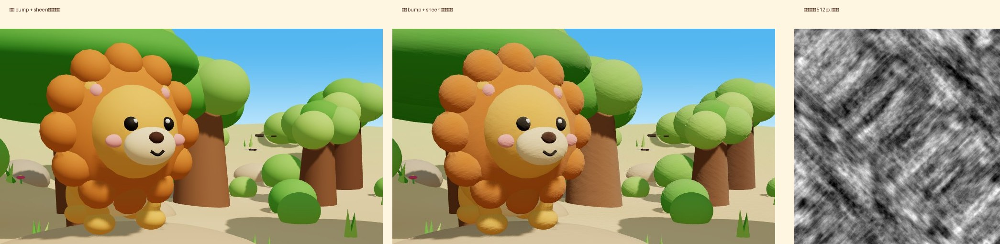

<div align="center">

# 🦁 Clay Safari · 繁忙的动物世界

**黏土风格的 3D 可交互双语认知世界 — 走进去，点一点，听听 10 位动物朋友的名字和叫声**

A claymation-style 3D bilingual (中文 / English) animal world for kids, built with Blender-scripted models and Three.js.

**[🌍 在线体验 · Play now](https://clay-safari.lanshuagent.com/)**

[](LICENSE)
[](https://threejs.org/)
[](https://vitejs.dev/)
[](https://www.blender.org/)
[](https://nodejs.org/)
[](#-技术亮点)
[](#-参与贡献)



<sub>按 <kbd>M</kbd> 进入的俯瞰海报视角 · 左沙右草、一条 S 形河流和一座小桥，17 个物件都带中文 / 拼音 / 英文标签</sub>

</div>

---

## ✨ 特性

- **10 只黏土动物 + 7 件探险道具**：狮子、长颈鹿、斑马、大象、猴子、河马、鳄鱼、蛇、小鸟、鱼；探险车、照相机、望远镜、树桩、骨头、花朵、香蕉
- **点一下就会动**：每种动物都有专属反应 — 大象举鼻子扇耳朵、鳄鱼张嘴、小鸟绕圈飞、鱼跃出水面、猴子转圈挥香蕉
- **双语认知闭环**：弹出词卡 → 朗读英文 → 播放叫声 → 朗读中文；动物收进「探险手册」，集齐 10 只撒彩带庆祝
- **🤖 机器人向导**：点它开始自动导览，沿探险路线逐个介绍，A\* 寻路自动绕河走桥
- **自由探索**：WASD 行走、点击地面前往、拖动旋转、滚轮 / 双指缩放、俯瞰全景；手机端有虚拟摇杆
- **视觉拉满**：实时阳光 + 软阴影、带流动高光和岸边泡沫的河水、飘动的黏土云、笑脸太阳、蝴蝶、飞鸟、水波、星星、彩带
- **零素材文件**：模型由脚本生成，纹理由噪声生成，叫声由 Web Audio 合成，名字由 Web Speech 朗读 — 完全离线可玩

<div align="center">
 
</div>

## 🚀 快速开始

需要 Node.js 20.19+（20.x）或 22.12+。

```bash
git clone https://github.com/cclank/clay-safari.git
cd clay-safari
npm install
npm run dev          # http://localhost:5290
```

开发服务器默认仅供本机访问。需要手机在同一局域网调试时，运行 `npm run dev -- --host`。

```bash
npm run build        # 打包到 dist/
npm run preview      # 预览打包结果 http://localhost:5291
```

模型已经导出在 `public/models/` 里，**不需要安装 Blender 就能运行**。想改动物造型再重新生成：

```bash
# 需要 Blender 5.x；BLENDER 可指向任意 Blender 可执行文件
BLENDER=/Applications/Blender.app/Contents/MacOS/Blender npm run models
```

## ☁️ 部署到 Cloudflare

在线地址：**https://clay-safari.lanshuagent.com/**

项目使用 Cloudflare Workers Static Assets 托管 `dist/`。部署配置保存在 `wrangler.jsonc`，无需配置应用 API 密钥。

```bash
npx wrangler@4.114.0 login   # 首次部署时登录 Cloudflare
npm run deploy             # 构建并部署
```

Fork 后请先修改 `wrangler.jsonc` 中的 Worker 名称和自定义域名，使用自己 Cloudflare 账号下的域名；也可以移除 `routes`，仅使用 `workers.dev` 地址。

## 🎮 操作

| 操作 | 桌面 | 手机 |
|---|---|---|
| 行走 | <kbd>W</kbd><kbd>A</kbd><kbd>S</kbd><kbd>D</kbd> / 方向键，<kbd>Shift</kbd> 加速 | 左下角摇杆 |
| 前往某处 | 点击地面 | 点击地面 |
| 旋转 / 缩放 | 拖动 / 滚轮 | 拖动 / 双指 |
| 认识动物 | 点击动物或道具 | 点击 |
| 自动导览 | 点击 🤖 或 <kbd>T</kbd> | 点击 🤖 |
| 俯瞰全景 | <kbd>M</kbd> | 🗺️ 按钮 |
| 隐藏 / 显示标签 | <kbd>L</kbd> | 🏷️ 按钮 |
| 帮助 | <kbd>H</kbd> | ❓ 按钮 |

## 🧱 制作流程

```
参考图定风格 ──▶ Blender 脚本捏动物 ──▶ 导出 GLB ──▶ Three.js 生成世界 ──▶ 互动 + 声音 ──▶ 实测打包
```

1. **定风格与布局** — 从参考海报提取奶油配色、圆润造型和标签样式，在 [`src/data.js`](src/data.js) 里重新规划地图、物件位置和一条穿过小桥的探险路线。
2. **Blender 脚本建模** — [`blender/build_animals.py`](blender/build_animals.py) 只用球体、胶囊、贝塞尔管道和倒角盒子，每只动物 20–40 行，19 个模型一次跑完约 10 秒。会动的部位（头、尾、鼻子、下颌、翅膀、耳朵）挂在独立的 Empty 上，用 `pivot()` 把原点挪到关节处，导出后 Three.js 直接绕关节旋转，不需要骨骼。
3. **黏土质感** — [`src/clay.js`](src/clay.js) 用分形噪声生成四方连续的灰度凹凸图，配合 `MeshPhysicalMaterial` 的 sheen 层做轮廓柔光。加载 GLB 时按「关节 × 颜色」合并网格，一只 40 个零件的动物只需约 6 次绘制。
4. **程序化世界** — [`src/world.js`](src/world.js) 生成顶点色地形（沙地 / 草地 / 小路 / 河岸）、河流刻槽、在标准材质里注入着色器的水面、拱桥、实例化植被、太阳、云和一圈「黏土台面」裙边。河道曲线和地形共用同一个公式，水面泡沫因此永远贴着岸。
5. **互动与声音** — 相机跟随、0.5 单位网格的 A\* 寻路、专属反应动画、机器人自动导览；[`src/audio.js`](src/audio.js) 用振荡器、噪声和滤波器合成 17 种叫声与音效，Web Speech 读中英文名字。
6. **实测打包** — 桌面 / 手机布局、Vite 打包；桌面端开启 Bloom 与 4096 阴影贴图，手机端自动降级。

<div align="center">

<br/><sub>左：关闭凹凸和 sheen，像光滑塑料 · 中：开启后的黏土颗粒与柔光 · 右：程序生成的凹凸图</sub>
</div>

## 🛠 技术亮点

| 模块 | 技术 |
|---|---|
| 建模 | Blender Python (bpy) 参数化建模，glTF 导出，`matrix_parent_inverse` 关节枢轴 |
| 渲染 | Three.js r185，`MeshPhysicalMaterial` sheen，PCF 软阴影，ACES 色调映射，`EffectComposer` + `UnrealBloomPass` |
| 世界 | 值噪声 / fbm 地形与纹理，顶点色绘制，`InstancedMesh` 批量植被，`onBeforeCompile` 注入水面着色器 |
| 寻路 | 网格 A\*（八方向、禁止穿角）+ 视线拉直 |
| 声音 | Web Audio API 合成（振荡器、噪声、双二阶滤波、波形整形），Web Speech API 朗读 |
| 工程 | Vite 8，ES Modules，零运行时依赖（仅 three） |

## 📁 目录结构

```
clay-safari/
├── blender/
│   └── build_animals.py     # Blender 脚本：19 个黏土模型 → GLB
├── public/models/           # 导出的 GLB（约 3.9 MB）
├── src/
│   ├── data.js              # 地图布局、动物数据、导览路线
│   ├── clay.js              # 黏土材质、凹凸图、GLB 加载与网格合并
│   ├── world.js             # 地形 / 河流 / 植被 / 天空 / 寻路网格
│   ├── nav.js               # A* 寻路
│   ├── animals.js           # 动物摆放、浮动词卡、待机与点击动画
│   ├── player.js            # 探险家控制与相机
│   ├── tour.js              # 机器人自动导览
│   ├── audio.js             # TTS + 合成叫声 + 环境音
│   ├── effects.js           # 蝴蝶、飞鸟、水波、星星、彩带
│   ├── ui.js                # 加载页、词卡、探险手册、摇杆
│   ├── tween.js             # 极简补间引擎
│   └── main.js              # 入口：渲染循环、输入、发现流程
├── docs/images/             # README 截图
├── index.html
└── vite.config.js           # Vite 构建配置
```

## 🎨 自定义

**加一只新动物**

1. 在 `build_animals.py` 里写一个 `build_xxx()`，把会动的部位挂到 `head` / `tail` 等 Empty 下并调用 `pivot()`，加进 `BUILDERS`，运行 `npm run models`
2. 在 `src/data.js` 的 `ITEMS` 里加一条：中文、拼音、英文、emoji、位置、朝向、缩放、导览观察点
3. 在 `src/animals.js` 的 `update()` 和 `react()` 里加待机和点击动作，在 `src/audio.js` 的 `CALLS` 里加叫声
4. 如需放进探险手册，`kind` 设为 `'animal'`

**换成真实动物录音** — 把录音放到 `public/sounds/<id>.mp3`，在 `audio.js` 的 `animalSound(id)` 里用 `new Audio()` 播放并在 `ended` 时 resolve，其余流程不用改。

**换语言** — 词卡文案全部来自 `ITEMS`，`speak()` 的语言代码在 `main.js` 的 `sayChain()` 里。

## ⚡ 性能

- 桌面：约 600 次绘制、90 万三角面，4096 阴影贴图 + Bloom，M 系列 Mac 上稳定 60 fps
- 手机：自动关闭后处理、阴影降到 2048、像素比上限 1.5、竖屏自动加宽视角
- 首屏加载约 4.6 MB（其中模型 3.9 MB），无外部字体和音频请求

## 🗺 路线图

- [ ] 真实动物录音（CC0）可选包
- [ ] 昼夜循环与萤火虫
- [ ] 更多语言（日语 / 韩语 / 西班牙语词卡）
- [ ] 动物「小测验」模式：听声音找动物
- [ ] Draco 压缩模型

## 🤝 参与贡献

欢迎 Issue 和 PR。新动物、新的叫声配方、性能优化、翻译都很欢迎。提交前请跑一遍 `npm run build` 确认无报错。

## 📄 许可证

[MIT](LICENSE) © 2026 lank

<div align="center"><sub>Made with clay, code and a lot of spheres 🟠🟢🔵</sub></div>
